

# 概括

-   讨论目标仍放在 `EEG->voice`。
-   当前公开监督先支持
    `EEG -> token / latent -> speech representation alignment -> training`
    这一段。
-   本地 56 个 EDF 已全部到位，56 个 EDF 已完成完整导出。
-   直接 `EEG -> waveform` 的公开监督仍然缺失；当前已公开的标签集中在
    `phoneme / articulation / lexical` 层级。

本文按这条链来写：`连续 EEG -> EEG encoder -> EEG latent / token -> speech side 对齐 -> 训练 -> 后续 voice decoder 扩展`。

# 数据来源：实验设计、条件与输出

这套数据不是“已经配好音频波形监督的 EEG-&gt;voice 数据”，而是两批
`TMS + EEG + speech-unit labels`
的连续记录。实验本身是语音知觉任务，不是想象说话。

-   `2019`：`P01-P08`，只有 `phonemes`。
-   `2021`：`S01-S16`，包含 `phonemes`、`single-phoneme`、`Words`。
-   每条记录本体都是连续 EEG；后续所有
    trial、token、对齐与训练，都是从这些连续记录里再切出来的。

先把实验流程拆开说清楚：

-   被试听到的是嵌在白噪声里的语音刺激，并按键作答；`single-phoneme`
    还包含听后重复。
-   论文里写的是六个辅音 `/b p d t s z/` 和五个元音
    `/i ε ɑ u oʊ/`；本地文件里通常简写成 `b p d t s z` 和 `i e a u o`。
-   `trial`
    可以理解成“一次完整的刺激呈现和反应过程”。对当前数据来说，一次 trial
    至少包含一次 `TMS` 标记和一次 `stimulus` 标记。
-   `events.tsv` 是事件表，不是一行一个 trial。以 `P01 phonemes`
    为例，原始 `events.tsv` 有 952 行，但其中 `TMS` 事件只有 476
    行，所以更接近 “476 个 trial，每个 trial 至少两类事件”。
-   本地整理后的 `local_events_manifest.csv` 则是一行一个 trial，所以第
    3 节里看到的 `3742 / 3355 / 3693` 都是 trial 数，不是 event 行数。

`TMS` 和 `stimulus` 这两个事件的意思分别是：

-   `TMS`：成对 TMS 脉冲里的最后一个脉冲时间点；后续做 epoch 时，这是
    trial 的神经调制起点。
-   `stimulus`：真正的声音刺激起点；后续做 speech-unit
    对齐时，这通常是更核心的时间锚点。
-   `phonemes` 和 `Words` 里，`TMS -> stimulus` 间隔固定为 `50 ms`。
-   `single-phoneme` 里，`TMS -> stimulus` 间隔不是固定值，约在
    `70.0-427.5 ms`。

测试时长也要分“论文协议”和“本地连续记录”两层看：

-   论文描述的 TMS-EEG 主实验时长大约是
    `2019 = 49 分钟`、`2021 = 58 分钟`。
-   本地导出的连续记录反映的是实际整段采集时长，所以会受准备、区块拆分和记录边界影响。
-   `2019` 每个 `P` 被试只有 1 条 `phonemes` 连续记录；例如 `P01`
    当前导出文件是 54.8 分钟。
-   `2021` 每个 `S` 被试有 3 条连续记录；例如 `S01` 的
    `phonemes + single-phoneme + Words` 三条记录合计约 168.3 分钟。

三类任务分别是什么：

-   `phonemes`：双音素识别任务。`2019` 是 `40` 个 `CV/VC` 组合；`2021`
    保留了其中共享的 `20` 个 `CV` 组合。标签既可以落在
    `phoneme1 + phoneme2`，也可以落在 `place / manner / voicing`。
-   `single-phoneme`：单音素听-说任务，只在 `2021` 出现。共有 `11`
    个离散单位：a, b, d, e, i, o, p, s, t, u, z。
-   `Words`：词 / 假词任务，只在 `2021` 出现。高层标签最直接的是
    `real / nonce`，但本地 trial 表里也保留了
    `phoneme1 + phoneme2 + phoneme3`。

`Words` 里具体使用的词基可以直接列出来：

-   `real`：bed, bit, bot, but, dip, dot, pat, tap, ted, tub
-   `nonce`：bad, bep, dab, deb, dit, pib, pod, put, tob, tup

条件变量主要由 `tmstarget` 给出，它表示当前 trial 所属的刺激 /
控制条件块：

-   `phonemes`：`lip / tongue / control_lip / control_tongue`
-   `Words`：`BA06 / BA44 / control_BA06 / control_BA44`
-   `single-phoneme`：只出现 `control_*` 条件，没有 active TMS 标签

输入和输出可以这样看：

-   实验输入：被呈现的 speech unit，加上当时的 `tmstarget` 条件
-   原始输出：连续 EEG、`events.tsv`、`channels.tsv`、`eeg.json`
-   本地整理后输出：`local_events_manifest.csv`、`full_eeg.h5`、`full_export_manifest.json`、`channel_stats.csv`、`overview / psd`
    图

常见字段的含义：

-   `phoneme1 / phoneme2 / phoneme3`：音素标签
-   `place / manner / voicing`：构音学标签
-   `category`：在 `Words` 里主要对应 `real / nonce`
-   `tmstarget`：当前 trial 的刺激条件标签

<table>
<caption>
表 3. 三类任务的刺激单位、具体项目、标签空间与条件标签
</caption>
<thead>
<tr>
<th style="text-align:left;">
任务
</th>
<th style="text-align:left;">
刺激单位
</th>
<th style="text-align:left;">
具体项目
</th>
<th style="text-align:left;">
标签空间
</th>
<th style="text-align:left;">
条件标签
</th>
</tr>
</thead>
<tbody>
<tr>
<td style="text-align:left;">
2019 phonemes
</td>
<td style="text-align:left;">
双音素；40 个 CV/VC 组合
</td>
<td style="text-align:left;">
ab, ad, ap, at, ba, be, bi, bo, bu, da, de, di, do, du, eb, ed, ep, et,
ib, id, ip, it, ob, od, op, ot, pa, pe, pi, po, pu, ta, te, ti, to, tu,
ub, ud, up, ut
</td>
<td style="text-align:left;">
phoneme1 + phoneme2；place / manner / voicing
</td>
<td style="text-align:left;">
lip / tongue / control\_lip / control\_tongue
</td>
</tr>
<tr>
<td style="text-align:left;">
2021 phonemes
</td>
<td style="text-align:left;">
双音素；20 个共享 CV 组合
</td>
<td style="text-align:left;">
ba, be, bi, bo, bu, da, de, di, do, du, pa, pe, pi, po, pu, ta, te, ti,
to, tu
</td>
<td style="text-align:left;">
phoneme1 + phoneme2；place / manner / voicing
</td>
<td style="text-align:left;">
lip / tongue / control\_lip / control\_tongue
</td>
</tr>
<tr>
<td style="text-align:left;">
2021 single-phoneme
</td>
<td style="text-align:left;">
单音素；11 个单位
</td>
<td style="text-align:left;">
a, b, d, e, i, o, p, s, t, u, z
</td>
<td style="text-align:left;">
phoneme1；place / manner / voicing
</td>
<td style="text-align:left;">
control\_BA06 / control\_BA44
</td>
</tr>
<tr>
<td style="text-align:left;">
2021 Words
</td>
<td style="text-align:left;">
词 / 假词；20 个 lexical bases
</td>
<td style="text-align:left;">
bad, bep, dab, deb, dit, pib, pod, put, tob, tup, bed, bit, bot, but,
dip, dot, pat, tap, ted, tub
</td>
<td style="text-align:left;">
real / nonce；phoneme1 + phoneme2 + phoneme3
</td>
<td style="text-align:left;">
BA06 / BA44 / control\_BA06 / control\_BA44
</td>
</tr>
</tbody>
</table>

表 3 可以直接当成“这套数据到底给了什么刺激”的总表来读：

-   `刺激单位`：模型最直接面对的分类对象。
-   `具体项目`：当前任务里实际出现过的音素组合或词基。
-   `标签空间`：当前数据已经公开给出的监督标签。
-   `条件标签`：`tmstarget` 中用于区分刺激 / 控制块的字段值。
-   `2019 phonemes` 给的是 `40` 个双音素组合：ab, ad, ap, at, ba, be,
    bi, bo, bu, da, de, di, do, du, eb, ed, ep, et, ib, id, ip, it, ob,
    od, op, ot, pa, pe, pi, po, pu, ta, te, ti, to, tu, ub, ud, up, ut。
-   `2021 phonemes` 只保留共享的 `20` 个 `CV` 组合：ba, be, bi, bo, bu,
    da, de, di, do, du, pa, pe, pi, po, pu, ta, te, ti, to, tu。
-   `2021 single-phoneme` 给的是 `11` 个单音素：a, b, d, e, i, o, p, s,
    t, u, z。
-   `2021 Words` 给的是 `20` 个词基，其中 `10` 个真实词、`10` 个假词。

# 当前数据概览

这一节分两层看：

-   先看全量数据：`2019` 和 `2021` 一共包含 4 个“年份 / 任务”块。
-   再看当前优先子集：后面的柱图只保留最适合当前研究路线的 3
    个子集，不是全部任务总图。

全量数据分别是：

-   `2019 / phonemes`：8 名被试，3,742 trials
-   `2021 / phonemes`：16 名被试，3,840 trials
-   `2021 / single-phoneme`：16 名被试，3,355 trials
-   `2021 / Words`：16 名被试，3,693 trials

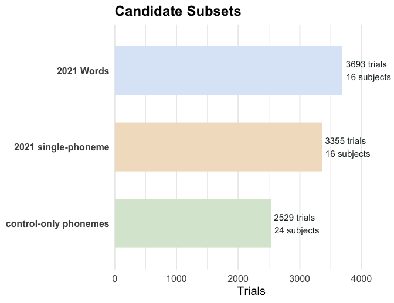

-   上面这张图只画了当前优先子集，没有把 `2019 / phonemes` 单独放进来。
-   `2019` 并不是没用到，而是主要被吸收到 `control-only phonemes`
    这个跨年子集里。
-   当前讨论集中在
    `2021 single-phoneme`、`control-only phonemes`、`2021 Words`
    三个子集。
-   `2021 single-phoneme = 3355 trials`，`2021 Words = 3693 trials`，`control-only phonemes = 2529 trials`。
-   这里的 `control-only phonemes = 2529` 指的是“2019 + 2021
    两年里，所有 `tmstarget` 以 `control` 开头的 phonemes trials
    全部加总”，其中
    `2019 = r fmt_num(control_only_2019)`，`2021 = r fmt_num(control_only_2021)`。
-   如果只保留两年完全共享的那 `20` 个 `CV` 组合，而不把 `2019` 的额外
    `VC` 组合算进去，那么这个数会变成 1,882，不是 `2529`。
-   这三个子集分别对应 unit-level 基线、跨年对齐、以及更高层 speech
    unit。
-   图中英文项： `Candidate Subsets = 候选子集` `Trials = 试次数`
    `subjects = 被试数`

<table>
<caption>
表 4. 当前三个优先子集的规模、类别数与研究价值
</caption>
<thead>
<tr>
<th style="text-align:left;">
priority
</th>
<th style="text-align:left;">
subset\_name
</th>
<th style="text-align:left;">
subset\_definition
</th>
<th style="text-align:left;">
recommended\_unit
</th>
<th style="text-align:left;">
subjects
</th>
<th style="text-align:left;">
trials
</th>
<th style="text-align:left;">
class\_count
</th>
<th style="text-align:left;">
class\_balance
</th>
<th style="text-align:left;">
control\_only\_version
</th>
<th style="text-align:left;">
cross\_year\_alignment
</th>
<th style="text-align:left;">
why\_useful
</th>
</tr>
</thead>
<tbody>
<tr>
<td style="text-align:left;">
1
</td>
<td style="text-align:left;">
2021 single-phoneme
</td>
<td style="text-align:left;">
study\_year=2021, task=single-phoneme
</td>
<td style="text-align:left;">
phoneme1
</td>
<td style="text-align:left;">
16
</td>
<td style="text-align:left;">
3355
</td>
<td style="text-align:left;">
11
</td>
<td style="text-align:left;">
完全均衡
</td>
<td style="text-align:left;">
是，且全部 trial 均为 control\* 条件
</td>
<td style="text-align:left;">
否，2019 无 single-phoneme 任务
</td>
<td style="text-align:left;">
最干净的离散 speech-unit 数据，适合先看 EEG token 是否可分
</td>
</tr>
<tr>
<td style="text-align:left;">
2
</td>
<td style="text-align:left;">
2021 Words
</td>
<td style="text-align:left;">
study\_year=2021, task=Words
</td>
<td style="text-align:left;">
category (real/nonce)，另有 20 个 lexical bases
</td>
<td style="text-align:left;">
16
</td>
<td style="text-align:left;">
3693
</td>
<td style="text-align:left;">
2
</td>
<td style="text-align:left;">
完全均衡
</td>
<td style="text-align:left;">
是，存在 control\_BA06 / control\_BA44 子集
</td>
<td style="text-align:left;">
否，2019 无 Words 任务
</td>
<td style="text-align:left;">
最接近高层 speech unit，可先做粗粒度 lexical token 准备
</td>
</tr>
<tr>
<td style="text-align:left;">
3
</td>
<td style="text-align:left;">
control-only phonemes
</td>
<td style="text-align:left;">
task=phonemes, tmstarget startswith control
</td>
<td style="text-align:left;">
20 shared phoneme bases（跨年）或 articulation labels
</td>
<td style="text-align:left;">
24
</td>
<td style="text-align:left;">
2529
</td>
<td style="text-align:left;">
20
</td>
<td style="text-align:left;">
不均衡
</td>
<td style="text-align:left;">
是，当前子集即 control-only
</td>
<td style="text-align:left;">
是，但只有 20 个 shared bases
</td>
<td style="text-align:left;">
唯一具备跨 2019/2021 对齐基础的离散 phoneme 子集
</td>
</tr>
</tbody>
</table>

表 4 列说明：

-   `priority`：当前文稿里的排序。
-   `subset_name`：子集名称。
-   `subset_definition`：筛选条件。
-   `recommended_unit`：当前子集对应的 speech unit。
-   `subjects`：被试数。
-   `trials`：试次数。
-   `class_count`：类别数。
-   `class_balance`：类别是否均衡。
-   `control_only_version`：是否存在只保留 control 条件的版本。
-   `cross_year_alignment`：是否有跨 2019/2021 的对齐基础。
-   `why_useful`：这张表里保留该子集的原因。

# 数据结构与代表性图像

<figure class="figure-card">
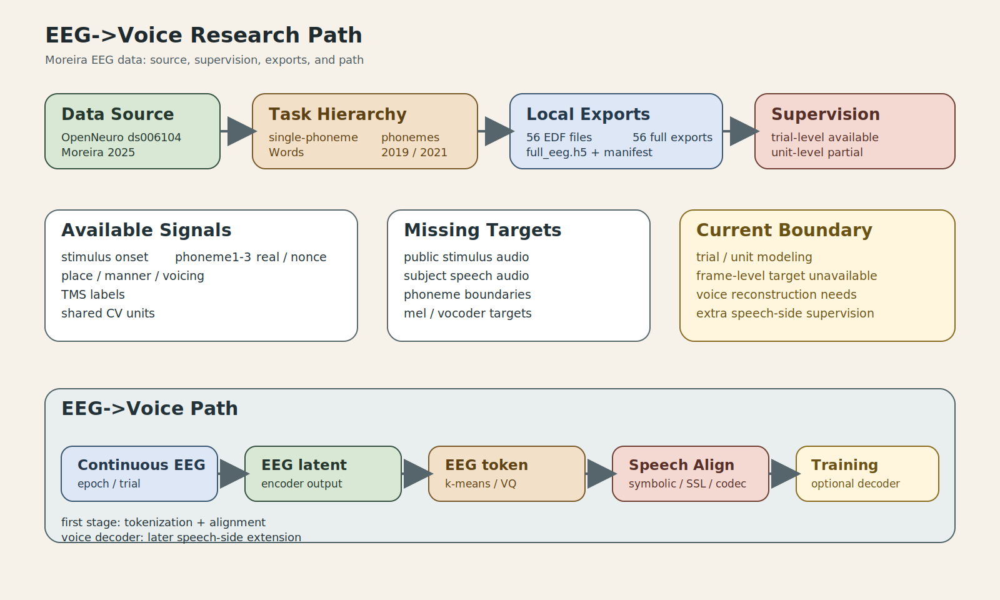
<figcaption>
图 1. EEG 数据总图。概括数据来源、任务层级、公开监督边界以及从 EEG 走向
token、对齐和训练的整体路径。
</figcaption>
</figure>
<figure class="figure-card">
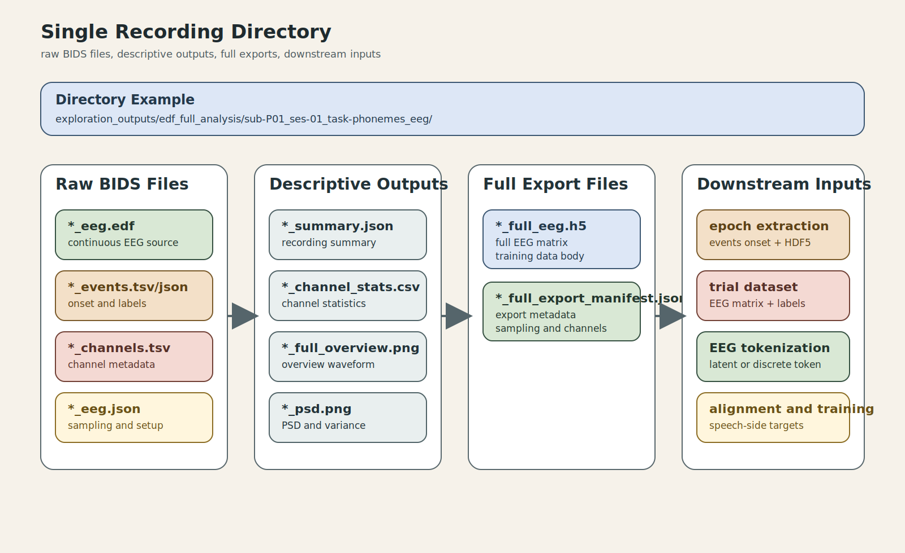
<figcaption>
图 2. 单条记录目录结构图。展示原始 BIDS
文件、描述性结果、完整导出文件，以及后续 epoch / trial / token /
alignment 的衔接关系。
</figcaption>
</figure>

<figure class="figure-card">
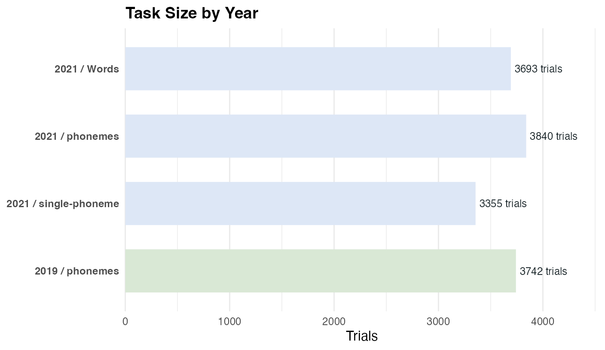
<figcaption>
图 3. 按年份和任务汇总的数据规模图。这里的 `Trials` 直接来自
`local_events_manifest.csv`，也就是整理后的一行一个
trial；`2019 / phonemes`、`2021 / single-phoneme` 这类标签表示“年份 /
任务”。
</figcaption>
</figure>
<figure class="figure-card">

<figcaption>
图 4. TMS 到 stimulus onset 的时间间隔图。说明任务之间的刺激触发与 TMS
时间关系并不固定，后续 epoch 需要基于真实 onset 而不是固定偏移切片。
</figcaption>
</figure>

图 1 到图 4 的英文项如下：

-   `full export`：完整导出结果。
-   `downstream inputs`：后续训练输入。
-   `Rows`：事件表行数。
-   `stimulus onset`：刺激开始时间。
-   `TMS`：经颅磁刺激条件。

# 2019 / 2021 被试结构树图

<figure class="figure-card">
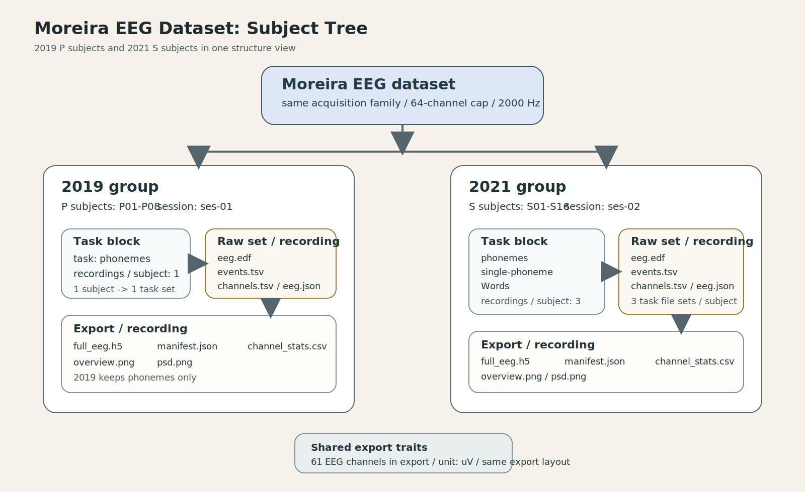
<figcaption>
图 5. Moreira 被试结构树图。把 `2019 / P subjects` 和
`2021 / S subjects`
放在同一棵树里，直接对应被试编号、任务数、原始文件组数和完整导出目录。
</figcaption>
</figure>

这张树图只做结构说明，图内英文项如下：

-   `P subjects / S subjects`：2019 年份的 `P` 被试和 2021 年份的 `S`
    被试。
-   `recordings / subject`：每个被试名下的 EEG 记录数。
-   `raw set / recording`：每条记录对应的一组原始文件，通常包括
    `edf`、`events.tsv`、`channels.tsv`、`eeg.json`。
-   `export / recording`：每条记录导出后的主要文件，包括
    `full_eeg.h5`、`manifest.json`、`channel_stats.csv`、`overview.png`、`psd.png`。

2019 和 2021 的核心区别在两点：

-   2019 只有 `phonemes`，每个 `P` 被试只有 1 条记录。
-   2021 同时有 `phonemes`、`single-phoneme`、`Words`，每个 `S` 被试有 3
    条记录。

# 2019 / 2021 单被试数据导图

<figure class="figure-card">
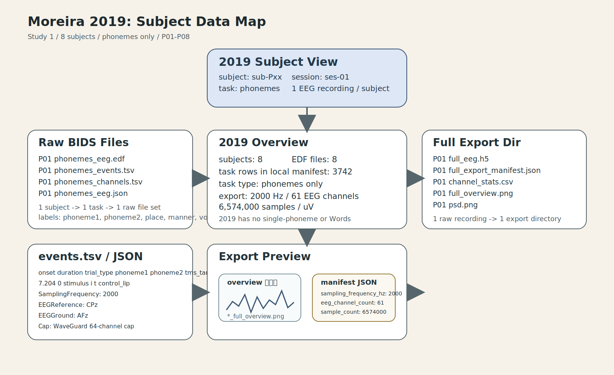
<figcaption>
图 7. Moreira 2019 单被试数据导图。一个 `sub-Pxx` 只有 `phonemes`
一套记录，对应一套原始 BIDS 文件和一套完整导出目录。
</figcaption>
</figure>
<figure class="figure-card">
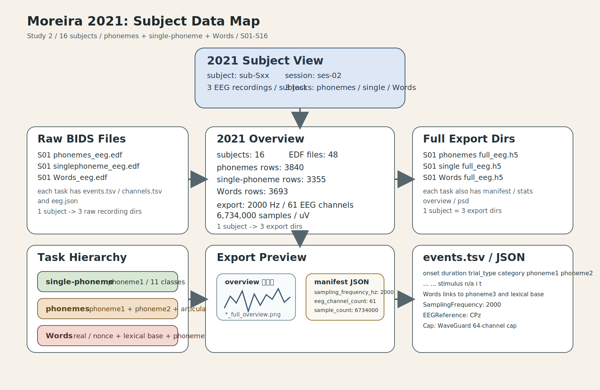
<figcaption>
图 8. Moreira 2021 单被试数据导图。一个 `sub-Sxx` 同时拥有
`phonemes`、`single-phoneme`、`Words` 三套记录，对应三套完整导出目录。
</figcaption>
</figure>

两张图按单被试视角整理了 2019 和 2021 的数据结构。图内英文项如下：

-   `Raw BIDS Files`：原始 BIDS 文件。
-   `Full Export Dir / Dirs`：完整导出目录。
-   `events.tsv / JSON`：事件表和 JSON 元数据示例。
-   `Task Hierarchy`：任务层级。
-   `Export Preview`：导出后常见的图和 JSON 样式。

# 单个被试示例：P01

<figure class="figure-card">
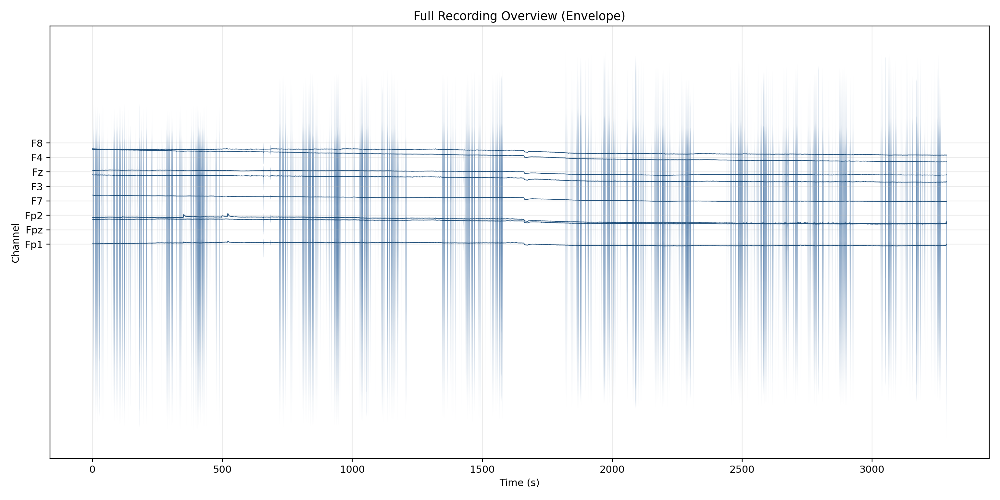
<figcaption>
图 1. `sub-P01_ses-01_task-phonemes_eeg` 的全程 EEG 概览图。这里用的是
recording-level `envelope + median`
视图，不是逐点原始折线，目的是把长时程波动结构压缩到一张图里。
</figcaption>
</figure>
<figure class="figure-card">
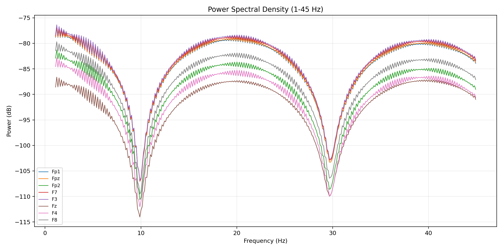
<figcaption>
图 2. `sub-P01_ses-01_task-phonemes_eeg` 的 PSD 图。`PSD` 是 power
spectral density，用来看记录级频谱形态。
</figcaption>
</figure>

<table>
<caption>
表 1. P01 完整导出 manifest 的关键字段
</caption>
<thead>
<tr>
<th style="text-align:left;">
字段
</th>
<th style="text-align:left;">
P01 示例值
</th>
</tr>
</thead>
<tbody>
<tr>
<td style="text-align:left;">
sampling\_frequency\_hz
</td>
<td style="text-align:left;">
2000
</td>
</tr>
<tr>
<td style="text-align:left;">
sample\_count
</td>
<td style="text-align:left;">
6,574,000
</td>
</tr>
<tr>
<td style="text-align:left;">
total\_channel\_count
</td>
<td style="text-align:left;">
62
</td>
</tr>
<tr>
<td style="text-align:left;">
eeg\_channel\_count
</td>
<td style="text-align:left;">
61
</td>
</tr>
<tr>
<td style="text-align:left;">
data\_unit
</td>
<td style="text-align:left;">
uV
</td>
</tr>
<tr>
<td style="text-align:left;">
total\_chunks
</td>
<td style="text-align:left;">
55
</td>
</tr>
</tbody>
</table>

P01 这里主要是把单个被试能看到的导出结果先摆出来。

-   `sampling_frequency_hz`：采样率。
-   `sample_count`：样本点总数。
-   `total_channel_count`：原始通道总数。
-   `eeg_channel_count`：其中被当作 EEG 使用的通道数。
-   `data_unit`：导出矩阵单位。
-   `total_chunks`：写 HDF5 时使用的分块数。

# 单个被试示例：S01

<figure class="figure-card">
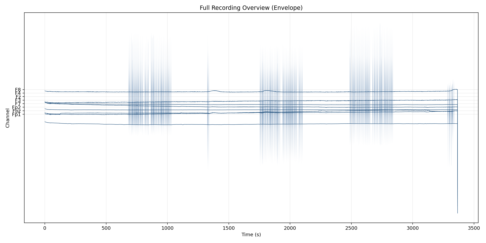
<figcaption>
图 3. `sub-S01_ses-02_task-phonemes_eeg` 的 recording-level EEG
概览图。`phonemes` 是 2021 年份里保留的双音素任务；当前图同样使用
`envelope + median` 方式显示全程结构。
</figcaption>
</figure>
<figure class="figure-card">
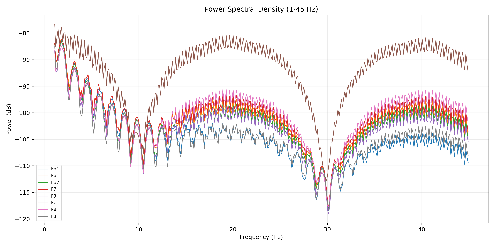
<figcaption>
图 4. `sub-S01_ses-02_task-Words_eeg` 的 PSD 图。这里选 `Words`
任务，是为了直接看到 2021 年比 2019 多出的高层 speech unit 条件。
</figcaption>
</figure>

<table>
<caption>
表 2. S01 三个任务的完整导出摘要
</caption>
<thead>
<tr>
<th style="text-align:left;">
task
</th>
<th style="text-align:left;">
sampling\_frequency\_hz
</th>
<th style="text-align:left;">
eeg\_channel\_count
</th>
<th style="text-align:left;">
sample\_count
</th>
<th style="text-align:left;">
data\_unit
</th>
</tr>
</thead>
<tbody>
<tr>
<td style="text-align:left;">
phonemes
</td>
<td style="text-align:left;">
2000
</td>
<td style="text-align:left;">
61
</td>
<td style="text-align:left;">
6,734,000
</td>
<td style="text-align:left;">
uV
</td>
</tr>
<tr>
<td style="text-align:left;">
single-phoneme
</td>
<td style="text-align:left;">
2000
</td>
<td style="text-align:left;">
61
</td>
<td style="text-align:left;">
6,734,000
</td>
<td style="text-align:left;">
uV
</td>
</tr>
<tr>
<td style="text-align:left;">
Words
</td>
<td style="text-align:left;">
2000
</td>
<td style="text-align:left;">
61
</td>
<td style="text-align:left;">
6,734,000
</td>
<td style="text-align:left;">
uV
</td>
</tr>
</tbody>
</table>

表 2 列说明：

-   `task`：S01 名下的任务。
-   `sampling_frequency_hz`：采样率。
-   `eeg_channel_count`：EEG 通道数。
-   `sample_count`：样本点总数。
-   `data_unit`：导出矩阵单位。

S01 和 P01 的区别主要在于：

-   `P01` 只有 `phonemes`。
-   `S01` 同时有 `phonemes`、`single-phoneme`、`Words`。

# 数据说明表（一）：原始 BIDS 与标签文件

<table>
<caption>
表 4. 原始 BIDS 文件与本地标签文件说明
</caption>
<thead>
<tr>
<th style="text-align:left;">
数据对象
</th>
<th style="text-align:left;">
示例路径
</th>
<th style="text-align:left;">
列/字段
</th>
<th style="text-align:left;">
数据量
</th>
<th style="text-align:left;">
大小
</th>
<th style="text-align:left;">
含义
</th>
</tr>
</thead>
<tbody>
<tr>
<td style="text-align:left;">
`*_eeg.edf`
</td>
<td style="text-align:left;">
openneuro\_downloads/ds006104-download/sub-P01/ses-01/eeg/sub-P01\_ses-01\_task-phonemes\_eeg.edf
</td>
<td style="text-align:left;">
连续矩阵；按时间点展开的多通道 EEG
</td>
<td style="text-align:left;">
56 files；P01 示例 6,574,000 samples
</td>
<td style="text-align:left;">
NA（P01 BIDS/annex 条目）
</td>
<td style="text-align:left;">
原始连续 EEG 记录本体
</td>
</tr>
<tr>
<td style="text-align:left;">
`*_events.tsv`
</td>
<td style="text-align:left;">
openneuro\_downloads/ds006104-download/sub-P01/ses-01/eeg/sub-P01\_ses-01\_task-phonemes\_events.tsv
</td>
<td style="text-align:left;">
onset, duration, trial\_type, category, manner, phoneme1, phoneme2,
place, … (12 fields)
</td>
<td style="text-align:left;">
56 files；P01 示例 952 行
</td>
<td style="text-align:left;">
58.8 kB（P01 单文件）
</td>
<td style="text-align:left;">
刺激 onset、trial\_type、phoneme、TMS 条件等事件标签
</td>
</tr>
<tr>
<td style="text-align:left;">
`*_channels.tsv`
</td>
<td style="text-align:left;">
openneuro\_downloads/ds006104-download/sub-P01/ses-01/eeg/sub-P01\_ses-01\_task-phonemes\_channels.tsv
</td>
<td style="text-align:left;">
name, type, units (3 fields)
</td>
<td style="text-align:left;">
56 files；P01 示例 61 行
</td>
<td style="text-align:left;">
719.0 B（P01 单文件）
</td>
<td style="text-align:left;">
通道名、通道类型、单位
</td>
</tr>
<tr>
<td style="text-align:left;">
`*_eeg.json`
</td>
<td style="text-align:left;">
openneuro\_downloads/ds006104-download/sub-P01/ses-01/eeg/sub-P01\_ses-01\_task-phonemes\_eeg.json
</td>
<td style="text-align:left;">
TaskName, TaskDescription, Instructions, EEGReference, EEGGround,
SamplingFrequency, … (13 fields)
</td>
<td style="text-align:left;">
56 files；P01 示例 13 keys
</td>
<td style="text-align:left;">
783.0 B（P01 单文件）
</td>
<td style="text-align:left;">
采样率、参考电极、硬件滤波、设备信息
</td>
</tr>
<tr>
<td style="text-align:left;">
`local_events_manifest.csv`
</td>
<td style="text-align:left;">
speech\_decoding/exploration\_outputs/tables/local\_events\_manifest.csv
</td>
<td style="text-align:left;">
stimulus, tms, correct\_key, tmstarget, task, trialn, order, phoneme1, …
(22 fields)
</td>
<td style="text-align:left;">
14,630 行
</td>
<td style="text-align:left;">
1.7 MB（CSV）
</td>
<td style="text-align:left;">
本地汇总事件表；把任务、音素、TMS、被试与年份拼到一张表里
</td>
</tr>
</tbody>
</table>

表 4 列说明：

-   `数据对象`：文件类型。
-   `示例路径`：当前项目里的示例路径。
-   `列/字段`：主要列名或 JSON key。
-   `数据量`：文件数、行数或 key 数。
-   `大小`：磁盘大小。
-   `含义`：这类文件在数据链条里的作用。

# 数据说明表（二）：分析与导出文件

<table>
<caption>
表 5. 当前分析结果与完整导出文件说明
</caption>
<thead>
<tr>
<th style="text-align:left;">
数据对象
</th>
<th style="text-align:left;">
示例路径
</th>
<th style="text-align:left;">
列/字段
</th>
<th style="text-align:left;">
数据量
</th>
<th style="text-align:left;">
大小
</th>
<th style="text-align:left;">
含义
</th>
</tr>
</thead>
<tbody>
<tr>
<td style="text-align:left;">
`candidate_subset_priority.csv`
</td>
<td style="text-align:left;">
speech\_decoding/exploration\_outputs/data\_priority/tables/candidate\_subset\_priority.csv
</td>
<td style="text-align:left;">
priority, subset\_name, subset\_definition, recommended\_unit, subjects,
trials, class\_count, class\_balance, … (11 fields)
</td>
<td style="text-align:left;">
3 行
</td>
<td style="text-align:left;">
951.0 B
</td>
<td style="text-align:left;">
三个候选数据子集的优先级、类别数、是否跨年可对齐
</td>
</tr>
<tr>
<td style="text-align:left;">
`supervision_signal_matrix.csv`
</td>
<td style="text-align:left;">
speech\_decoding/exploration\_outputs/data\_priority/tables/supervision\_signal\_matrix.csv
</td>
<td style="text-align:left;">
signal, status, evidence, why\_it\_matters (4 fields)
</td>
<td style="text-align:left;">
10 行
</td>
<td style="text-align:left;">
1.3 kB
</td>
<td style="text-align:left;">
当前公开监督到底有哪些、缺哪些
</td>
</tr>
<tr>
<td style="text-align:left;">
`alignment_granularity.csv`
</td>
<td style="text-align:left;">
speech\_decoding/exploration\_outputs/data\_priority/tables/alignment\_granularity.csv
</td>
<td style="text-align:left;">
granularity, status, available\_supervision, missing\_supervision,
takeaway (5 fields)
</td>
<td style="text-align:left;">
3 行
</td>
<td style="text-align:left;">
542.0 B
</td>
<td style="text-align:left;">
当前数据支持到哪种对齐粒度
</td>
</tr>
<tr>
<td style="text-align:left;">
`batch_run_summary.json`
</td>
<td style="text-align:left;">
speech\_decoding/exploration\_outputs/edf\_full\_analysis/batch\_run\_summary.json
</td>
<td style="text-align:left;">
mode, dataset\_root, output\_root, subjects, edf\_entries,
hydrated\_before, … (12 fields)
</td>
<td style="text-align:left;">
12 keys
</td>
<td style="text-align:left;">
436.0 B
</td>
<td style="text-align:left;">
56 个 EDF 的批处理总表
</td>
</tr>
<tr>
<td style="text-align:left;">
`*_full_export_manifest.json`
</td>
<td style="text-align:left;">
speech\_decoding/exploration\_outputs/edf\_full\_analysis/sub-P01\_ses-01\_task-phonemes\_eeg/sub-P01\_ses-01\_task-phonemes\_eeg\_full\_export\_manifest.json
</td>
<td style="text-align:left;">
source\_edf\_path, output\_h5\_path, sampling\_frequency\_hz,
duration\_seconds, sample\_count, total\_channel\_count, … (14 fields)
</td>
<td style="text-align:left;">
56 files；P01 示例 14 keys
</td>
<td style="text-align:left;">
2.2 kB（P01）
</td>
<td style="text-align:left;">
每个完整导出的采样率、通道数、样本数、路径等元数据
</td>
</tr>
<tr>
<td style="text-align:left;">
`*_full_eeg.h5`
</td>
<td style="text-align:left;">
speech\_decoding/exploration\_outputs/edf\_full\_analysis/sub-P01\_ses-01\_task-phonemes\_eeg/sub-P01\_ses-01\_task-phonemes\_eeg\_full\_eeg.h5
</td>
<td style="text-align:left;">
HDF5 dataset；P01 示例为 61 x 6,574,000 的连续 EEG 矩阵
</td>
<td style="text-align:left;">
56 files
</td>
<td style="text-align:left;">
15.8 GB（56 个 HDF5 总计）
</td>
<td style="text-align:left;">
后续 epoch、trial dataset、tokenization 的主数据本体
</td>
</tr>
<tr>
<td style="text-align:left;">
`*_channel_stats.csv`
</td>
<td style="text-align:left;">
speech\_decoding/exploration\_outputs/edf\_full\_analysis/sub-P01\_ses-01\_task-phonemes\_eeg/sub-P01\_ses-01\_task-phonemes\_eeg\_channel\_stats.csv
</td>
<td style="text-align:left;">
channel, mean\_uV, std\_uV, min\_uV, max\_uV, ptp\_uV (6 fields)
</td>
<td style="text-align:left;">
56 files；P01 示例 61 行
</td>
<td style="text-align:left;">
5.1 kB（P01）
</td>
<td style="text-align:left;">
每个通道的均值、标准差、极值、峰峰值
</td>
</tr>
</tbody>
</table>

表 5 的列结构和表 4 相同。这里的重点在两类文件：

-   `*_full_eeg.h5`：连续 EEG 主数据。
-   `*_full_export_manifest.json`：采样率、样本数、通道数、chunk
    等元数据。

# 数据示例

## P01 `events.tsv` 示例

<table>
<caption>
表 6. `sub-P01_ses-01_task-phonemes_events.tsv` 前 4 行
</caption>
<thead>
<tr>
<th style="text-align:left;">
onset
</th>
<th style="text-align:left;">
duration
</th>
<th style="text-align:left;">
trial\_type
</th>
<th style="text-align:left;">
category
</th>
<th style="text-align:left;">
manner
</th>
<th style="text-align:left;">
phoneme1
</th>
<th style="text-align:left;">
phoneme2
</th>
<th style="text-align:left;">
place
</th>
<th style="text-align:left;">
tms\_intensity
</th>
<th style="text-align:left;">
tms\_target
</th>
<th style="text-align:left;">
trial
</th>
<th style="text-align:left;">
voicing
</th>
</tr>
</thead>
<tbody>
<tr>
<td style="text-align:left;">
7.154
</td>
<td style="text-align:left;">
0
</td>
<td style="text-align:left;">
TMS
</td>
<td style="text-align:left;">
alveolar
</td>
<td style="text-align:left;">
stop
</td>
<td style="text-align:left;">
n/a
</td>
<td style="text-align:left;">
n/a
</td>
<td style="text-align:left;">
alveolar
</td>
<td style="text-align:left;">
110
</td>
<td style="text-align:left;">
control\_lip
</td>
<td style="text-align:left;">
1
</td>
<td style="text-align:left;">
no
</td>
</tr>
<tr>
<td style="text-align:left;">
7.204
</td>
<td style="text-align:left;">
0
</td>
<td style="text-align:left;">
stimulus
</td>
<td style="text-align:left;">
n/a
</td>
<td style="text-align:left;">
n/a
</td>
<td style="text-align:left;">
i
</td>
<td style="text-align:left;">
t
</td>
<td style="text-align:left;">
n/a
</td>
<td style="text-align:left;">
n/a
</td>
<td style="text-align:left;">
control\_lip
</td>
<td style="text-align:left;">
n/a
</td>
<td style="text-align:left;">
n/a
</td>
</tr>
<tr>
<td style="text-align:left;">
11.137
</td>
<td style="text-align:left;">
0
</td>
<td style="text-align:left;">
TMS
</td>
<td style="text-align:left;">
bilabial
</td>
<td style="text-align:left;">
stop
</td>
<td style="text-align:left;">
n/a
</td>
<td style="text-align:left;">
n/a
</td>
<td style="text-align:left;">
bilabial
</td>
<td style="text-align:left;">
110
</td>
<td style="text-align:left;">
lip
</td>
<td style="text-align:left;">
2
</td>
<td style="text-align:left;">
yes
</td>
</tr>
<tr>
<td style="text-align:left;">
11.187
</td>
<td style="text-align:left;">
0
</td>
<td style="text-align:left;">
stimulus
</td>
<td style="text-align:left;">
n/a
</td>
<td style="text-align:left;">
n/a
</td>
<td style="text-align:left;">
b
</td>
<td style="text-align:left;">
o
</td>
<td style="text-align:left;">
n/a
</td>
<td style="text-align:left;">
n/a
</td>
<td style="text-align:left;">
lip
</td>
<td style="text-align:left;">
n/a
</td>
<td style="text-align:left;">
n/a
</td>
</tr>
</tbody>
</table>

表 6 列说明：

-   `onset`：事件开始时间，单位秒。
-   `duration`：事件持续时间。
-   `trial_type`：事件类型，常见是 `TMS` 或 `stimulus`。
-   `category`：词类或构音类别标签。
-   `phoneme1 / phoneme2`：刺激里的音素。
-   `tms_target`：TMS 条件位置。
-   `trial`：试次编号。

## P01 `channels.tsv` 与 `eeg.json` 示例

<table>
<caption>
表 7. `sub-P01_ses-01_task-phonemes_channels.tsv` 前 6 行
</caption>
<thead>
<tr>
<th style="text-align:left;">
name
</th>
<th style="text-align:left;">
type
</th>
<th style="text-align:left;">
units
</th>
</tr>
</thead>
<tbody>
<tr>
<td style="text-align:left;">
Fp1
</td>
<td style="text-align:left;">
EEG
</td>
<td style="text-align:left;">
uV
</td>
</tr>
<tr>
<td style="text-align:left;">
Fpz
</td>
<td style="text-align:left;">
EEG
</td>
<td style="text-align:left;">
uV
</td>
</tr>
<tr>
<td style="text-align:left;">
Fp2
</td>
<td style="text-align:left;">
EEG
</td>
<td style="text-align:left;">
uV
</td>
</tr>
<tr>
<td style="text-align:left;">
F7
</td>
<td style="text-align:left;">
EEG
</td>
<td style="text-align:left;">
uV
</td>
</tr>
<tr>
<td style="text-align:left;">
F3
</td>
<td style="text-align:left;">
EEG
</td>
<td style="text-align:left;">
uV
</td>
</tr>
<tr>
<td style="text-align:left;">
Fz
</td>
<td style="text-align:left;">
EEG
</td>
<td style="text-align:left;">
uV
</td>
</tr>
</tbody>
</table>

表 7 列说明：

-   `name`：通道名。
-   `type`：通道类型。
-   `units`：该通道的测量单位。

<table>
<caption>
表 8. `sub-P01_ses-01_task-phonemes_eeg.json` 的 key-value 示例
</caption>
<thead>
<tr>
<th style="text-align:left;">
key
</th>
<th style="text-align:left;">
value
</th>
</tr>
</thead>
<tbody>
<tr>
<td style="text-align:left;">
TaskName
</td>
<td style="text-align:left;">
phonemes
</td>
</tr>
<tr>
<td style="text-align:left;">
TaskDescription
</td>
<td style="text-align:left;">
Listening to consonant-vowel and vowel-consonant phoneme pairs.
</td>
</tr>
<tr>
<td style="text-align:left;">
Instructions
</td>
<td style="text-align:left;">
Participants listened to audio clips immersed in white noise and
responded with button presses.
</td>
</tr>
<tr>
<td style="text-align:left;">
EEGReference
</td>
<td style="text-align:left;">
CPz
</td>
</tr>
<tr>
<td style="text-align:left;">
EEGGround
</td>
<td style="text-align:left;">
AFz
</td>
</tr>
<tr>
<td style="text-align:left;">
SamplingFrequency
</td>
<td style="text-align:left;">
2000
</td>
</tr>
<tr>
<td style="text-align:left;">
PowerLineFrequency
</td>
<td style="text-align:left;">
60
</td>
</tr>
<tr>
<td style="text-align:left;">
SoftwareFilters
</td>
<td style="text-align:left;">
n/a
</td>
</tr>
<tr>
<td style="text-align:left;">
HardwareFilters
</td>
<td style="text-align:left;">
{“HighpassFilter”:{“CutoffFrequency”:0.1},“LowpassFilter”:{“CutoffFrequency”:350}}
</td>
</tr>
<tr>
<td style="text-align:left;">
EEGPlacementScheme
</td>
<td style="text-align:left;">
extended 10-20 system
</td>
</tr>
<tr>
<td style="text-align:left;">
CapManufacturer
</td>
<td style="text-align:left;">
ANT Neuro
</td>
</tr>
<tr>
<td style="text-align:left;">
CapManufacturersModelName
</td>
<td style="text-align:left;">
WaveGuard 64-channel EEG cap
</td>
</tr>
<tr>
<td style="text-align:left;">
ManufacturersModelName
</td>
<td style="text-align:left;">
eego mylab system
</td>
</tr>
</tbody>
</table>

表 8 的两列分别是：

-   `key`：BIDS 规定或设备写入的字段名。
-   `value`：该字段的具体值。

这里常用的英文项包括：

-   `SamplingFrequency`：采样率。
-   `EEGReference`：参考电极。
-   `EEGGround`：地电极。
-   `HardwareFilters`：硬件滤波设置。
-   `EEGPlacementScheme`：电极布局方案。

## 本地事件总表与完整导出 manifest 示例

<table>
<caption>
表 9. `local_events_manifest.csv` 示例列与前 4 行
</caption>
<thead>
<tr>
<th style="text-align:left;">
stimulus
</th>
<th style="text-align:left;">
tmstarget
</th>
<th style="text-align:left;">
task
</th>
<th style="text-align:left;">
phoneme1
</th>
<th style="text-align:left;">
phoneme2
</th>
<th style="text-align:left;">
phoneme3
</th>
<th style="text-align:left;">
place
</th>
<th style="text-align:left;">
manner
</th>
<th style="text-align:left;">
voicing
</th>
<th style="text-align:left;">
subject\_id
</th>
<th style="text-align:left;">
study\_year
</th>
<th style="text-align:left;">
session\_id
</th>
</tr>
</thead>
<tbody>
<tr>
<td style="text-align:left;">
aB\_happy2
</td>
<td style="text-align:left;">
lip
</td>
<td style="text-align:left;">
phonemes
</td>
<td style="text-align:left;">
a
</td>
<td style="text-align:left;">
b
</td>
<td style="text-align:left;">
NA
</td>
<td style="text-align:left;">
alveolar
</td>
<td style="text-align:left;">
stop
</td>
<td style="text-align:left;">
no
</td>
<td style="text-align:left;">
P01
</td>
<td style="text-align:left;">
2019
</td>
<td style="text-align:left;">
01
</td>
</tr>
<tr>
<td style="text-align:left;">
uD\_happy2
</td>
<td style="text-align:left;">
tongue
</td>
<td style="text-align:left;">
phonemes
</td>
<td style="text-align:left;">
u
</td>
<td style="text-align:left;">
d
</td>
<td style="text-align:left;">
NA
</td>
<td style="text-align:left;">
alveolar
</td>
<td style="text-align:left;">
stop
</td>
<td style="text-align:left;">
no
</td>
<td style="text-align:left;">
P01
</td>
<td style="text-align:left;">
2019
</td>
<td style="text-align:left;">
01
</td>
</tr>
<tr>
<td style="text-align:left;">
aB\_happy2
</td>
<td style="text-align:left;">
tongue
</td>
<td style="text-align:left;">
phonemes
</td>
<td style="text-align:left;">
a
</td>
<td style="text-align:left;">
b
</td>
<td style="text-align:left;">
NA
</td>
<td style="text-align:left;">
alveolar
</td>
<td style="text-align:left;">
stop
</td>
<td style="text-align:left;">
no
</td>
<td style="text-align:left;">
P01
</td>
<td style="text-align:left;">
2019
</td>
<td style="text-align:left;">
01
</td>
</tr>
<tr>
<td style="text-align:left;">
aT\_happy2
</td>
<td style="text-align:left;">
lip
</td>
<td style="text-align:left;">
phonemes
</td>
<td style="text-align:left;">
a
</td>
<td style="text-align:left;">
t
</td>
<td style="text-align:left;">
NA
</td>
<td style="text-align:left;">
alveolar
</td>
<td style="text-align:left;">
stop
</td>
<td style="text-align:left;">
no
</td>
<td style="text-align:left;">
P01
</td>
<td style="text-align:left;">
2019
</td>
<td style="text-align:left;">
01
</td>
</tr>
</tbody>
</table>

表 9 列说明：

-   `stimulus`：刺激名。
-   `tmstarget`：TMS 条件。
-   `task`：任务名。
-   `phoneme1 / phoneme2 / phoneme3`：音素层标签。
-   `place / manner / voicing`：构音特征。
-   `subject_id`：被试编号。
-   `study_year`：2019 或 2021。
-   `session_id`：session 编号。

<table>
<caption>
表 10. `sub-P01_ses-01_task-phonemes_eeg_full_export_manifest.json`
关键字段
</caption>
<thead>
<tr>
<th style="text-align:left;">
字段
</th>
<th style="text-align:left;">
P01 示例值
</th>
</tr>
</thead>
<tbody>
<tr>
<td style="text-align:left;">
sampling\_frequency\_hz
</td>
<td style="text-align:left;">
2000
</td>
</tr>
<tr>
<td style="text-align:left;">
sample\_count
</td>
<td style="text-align:left;">
6,574,000
</td>
</tr>
<tr>
<td style="text-align:left;">
total\_channel\_count
</td>
<td style="text-align:left;">
62
</td>
</tr>
<tr>
<td style="text-align:left;">
eeg\_channel\_count
</td>
<td style="text-align:left;">
61
</td>
</tr>
<tr>
<td style="text-align:left;">
data\_unit
</td>
<td style="text-align:left;">
uV
</td>
</tr>
<tr>
<td style="text-align:left;">
total\_chunks
</td>
<td style="text-align:left;">
55
</td>
</tr>
</tbody>
</table>

表 10 各字段含义与前面的 P01 示例表相同，这里不再重复。

## P01 通道统计示例

<table>
<caption>
表 11. `sub-P01_ses-01_task-phonemes_eeg_channel_stats.csv` 前 6 行
</caption>
<thead>
<tr>
<th style="text-align:left;">
channel
</th>
<th style="text-align:left;">
mean\_uV
</th>
<th style="text-align:left;">
std\_uV
</th>
<th style="text-align:left;">
min\_uV
</th>
<th style="text-align:left;">
max\_uV
</th>
<th style="text-align:left;">
ptp\_uV
</th>
</tr>
</thead>
<tbody>
<tr>
<td style="text-align:left;">
AF3
</td>
<td style="text-align:left;">
-14986.4580
</td>
<td style="text-align:left;">
1455.4048
</td>
<td style="text-align:left;">
-83886.1
</td>
<td style="text-align:left;">
-8690.055
</td>
<td style="text-align:left;">
75196.05
</td>
</tr>
<tr>
<td style="text-align:left;">
AF4
</td>
<td style="text-align:left;">
4057.7727
</td>
<td style="text-align:left;">
1446.7163
</td>
<td style="text-align:left;">
-83886.1
</td>
<td style="text-align:left;">
21956.180
</td>
<td style="text-align:left;">
105842.28
</td>
</tr>
<tr>
<td style="text-align:left;">
AF7
</td>
<td style="text-align:left;">
15981.3643
</td>
<td style="text-align:left;">
1629.3116
</td>
<td style="text-align:left;">
-83886.1
</td>
<td style="text-align:left;">
19539.502
</td>
<td style="text-align:left;">
103425.60
</td>
</tr>
<tr>
<td style="text-align:left;">
AF8
</td>
<td style="text-align:left;">
8097.9551
</td>
<td style="text-align:left;">
1037.9069
</td>
<td style="text-align:left;">
-83886.1
</td>
<td style="text-align:left;">
20888.645
</td>
<td style="text-align:left;">
104774.75
</td>
</tr>
<tr>
<td style="text-align:left;">
C1
</td>
<td style="text-align:left;">
4257.9121
</td>
<td style="text-align:left;">
1214.5754
</td>
<td style="text-align:left;">
-83886.1
</td>
<td style="text-align:left;">
7276.913
</td>
<td style="text-align:left;">
91163.02
</td>
</tr>
<tr>
<td style="text-align:left;">
C2
</td>
<td style="text-align:left;">
977.0992
</td>
<td style="text-align:left;">
977.5645
</td>
<td style="text-align:left;">
-83886.1
</td>
<td style="text-align:left;">
11132.333
</td>
<td style="text-align:left;">
95018.44
</td>
</tr>
</tbody>
</table>

表 11 列说明：

-   `channel`：通道名。
-   `mean_uV`：均值。
-   `std_uV`：标准差。
-   `min_uV / max_uV`：最小值和最大值。
-   `ptp_uV`：peak-to-peak，峰峰值。

# 当前数据条件

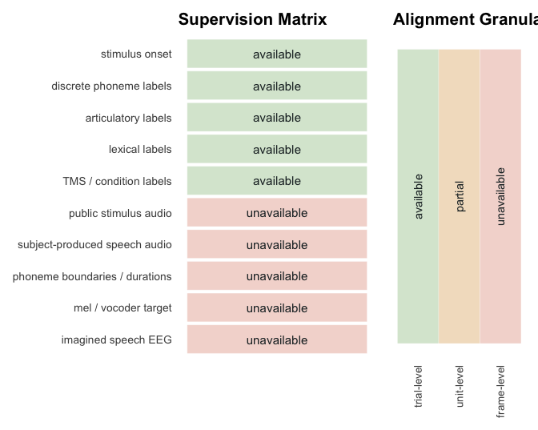

当前公开数据已经有：

-   stimulus onset
-   phoneme1 / phoneme2 / phoneme3
-   place / manner / voicing
-   real / nonce
-   TMS condition

当前公开数据还没有：

-   public stimulus audio
-   subject speech audio
-   phoneme boundaries
-   mel / vocoder targets

因此，当前公开监督主要支撑
`trial-level / unit-level modeling`，而不是高保真的 `EEG -> waveform`
监督。

图中的英文项：

-   `available`：当前可用。
-   `partial`：部分可用。
-   `unavailable`：当前缺失。
-   `granularity`：对齐粒度。

# 文献说明

<table>
<caption>
表 12. 当前五篇核心文献在同一框架下的比较
</caption>
<thead>
<tr>
<th style="text-align:left;">
论文
</th>
<th style="text-align:left;">
任务
</th>
<th style="text-align:left;">
神经数据
</th>
<th style="text-align:left;">
EEG表征
</th>
<th style="text-align:left;">
语音目标
</th>
<th style="text-align:left;">
对齐或训练机制
</th>
<th style="text-align:left;">
能借鉴什么
</th>
<th style="text-align:left;">
当前不能直接平移什么
</th>
</tr>
</thead>
<tbody>
<tr>
<td style="text-align:left;">
Moreira 2025
</td>
<td style="text-align:left;">
speech decoding dataset
</td>
<td style="text-align:left;">
2019 / 2021，听刺激 + 按键，64 通道 EEG
</td>
<td style="text-align:left;">
连续 EEG + BIDS 标签
</td>
<td style="text-align:left;">
phoneme / articulation / real-nonce
</td>
<td style="text-align:left;">
提供数据层级与 benchmark
</td>
<td style="text-align:left;">
明确任务层级、标签结构、跨年对照
</td>
<td style="text-align:left;">
没有公开 audio / mel / 边界级监督
</td>
</tr>
<tr>
<td style="text-align:left;">
Lee 2023
</td>
<td style="text-align:left;">
imagined EEG-&gt;voice
</td>
<td style="text-align:left;">
spoken + imagined EEG，小词表
</td>
<td style="text-align:left;">
CSP embedding
</td>
<td style="text-align:left;">
mel + waveform
</td>
<td style="text-align:left;">
GAN + CTC + transfer
</td>
<td style="text-align:left;">
EEG 先压缩，再接 mel generator 和 vocoder
</td>
<td style="text-align:left;">
依赖 paired speech target 与代理语音
</td>
</tr>
<tr>
<td style="text-align:left;">
Défossez 2023
</td>
<td style="text-align:left;">
speech perception decoding
</td>
<td style="text-align:left;">
175 名受试者 M/EEG
</td>
<td style="text-align:left;">
连续 latent sequence
</td>
<td style="text-align:left;">
wav2vec2 latent
</td>
<td style="text-align:left;">
contrastive alignment
</td>
<td style="text-align:left;">
EEG latent 与 speech SSL latent 的显式对齐
</td>
<td style="text-align:left;">
任务是感知语音，不是当前 trial 标签分类
</td>
</tr>
<tr>
<td style="text-align:left;">
DeWave 2024
</td>
<td style="text-align:left;">
EEG-&gt;text
</td>
<td style="text-align:left;">
ZuCo 阅读 EEG
</td>
<td style="text-align:left;">
VQ discrete codex
</td>
<td style="text-align:left;">
text embedding / decoder
</td>
<td style="text-align:left;">
VQ + contrastive + two-stage training
</td>
<td style="text-align:left;">
EEG token 化、离散码本、跨被试稳定性
</td>
<td style="text-align:left;">
目标是文本，不是语音
</td>
</tr>
<tr>
<td style="text-align:left;">
SpeechMedAssist 2026
</td>
<td style="text-align:left;">
speech LM adaptation
</td>
<td style="text-align:left;">
无 EEG；speech-text 多轮问诊
</td>
<td style="text-align:left;">
shared speech-text latent
</td>
<td style="text-align:left;">
speech dialogue / speech response
</td>
<td style="text-align:left;">
two-stage training
</td>
<td style="text-align:left;">
先能力注入，再模态重对齐的训练组织方式
</td>
<td style="text-align:left;">
不是 EEG 证据，不提供 EEG 表征或对齐标签
</td>
</tr>
</tbody>
</table>

这 5 篇文献对应的是同一条方法链上的不同部分：

-   `Moreira 2025` 提供数据结构、标签层级与监督边界。
-   `Lee 2023` 提供 `EEG -> mel -> waveform` 的直接重建上限范式。
-   `Défossez 2023` 提供 `EEG latent <-> speech SSL latent`
    的显式对齐范式。
-   `DeWave 2024` 提供 `EEG token 化 / VQ / contrastive`
    的离散化与对齐范式。
-   `SpeechMedAssist 2026`
    提供“先学前半段能力，再做模态重对齐”的训练组织方式。

表 12 列说明：

-   `论文`：文献名。
-   `任务`：该论文解决的任务。
-   `神经数据`：输入的脑信号条件。
-   `EEG表征`：论文中使用的 EEG 表征方式。
-   `语音目标`：输出或对齐目标。
-   `对齐或训练机制`：核心训练方式。
-   `能借鉴什么`：当前数据里可迁移的思路。
-   `当前不能直接平移什么`：与 Moreira 数据之间的差异。

# 文献方法摘要

<table>
<caption>
表 13. 五篇文献的方法链摘要
</caption>
<thead>
<tr>
<th style="text-align:left;">
论文
</th>
<th style="text-align:left;">
输入与任务
</th>
<th style="text-align:left;">
表征与编码
</th>
<th style="text-align:left;">
核心方法链
</th>
<th style="text-align:left;">
输出或对齐对象
</th>
<th style="text-align:left;">
当前相关点
</th>
</tr>
</thead>
<tbody>
<tr>
<td style="text-align:left;">
Moreira 2025
</td>
<td style="text-align:left;">
2019 / 2021 EEG dataset；phonemes、single-phoneme、Words
</td>
<td style="text-align:left;">
连续 EEG + BIDS 事件标签 + TMS 条件
</td>
<td style="text-align:left;">
数据发布 -&gt; benchmark 划分 -&gt; articulation / coarticulation 分析
-&gt; cross-year external validation
</td>
<td style="text-align:left;">
phoneme、articulation、real/nonce 等 unit-level 标签
</td>
<td style="text-align:left;">
当前数据的监督边界和实验切分来自这里
</td>
</tr>
<tr>
<td style="text-align:left;">
Lee 2023
</td>
<td style="text-align:left;">
spoken EEG + imagined EEG；小词表语音重建
</td>
<td style="text-align:left;">
CSP 特征 + EEG embedding
</td>
<td style="text-align:left;">
EEG encoder -&gt; mel generator -&gt; HiFi-GAN；spoken-to-imagined
transfer；HuBERT / CTC 辅助约束
</td>
<td style="text-align:left;">
mel-spectrogram + waveform
</td>
<td style="text-align:left;">
给出 EEG 到声学解码器的完整链条，但前提是 paired 或代理 speech target
</td>
</tr>
<tr>
<td style="text-align:left;">
Défossez 2023
</td>
<td style="text-align:left;">
non-invasive M/EEG；speech perception decoding
</td>
<td style="text-align:left;">
brain encoder latent + wav2vec2 latent
</td>
<td style="text-align:left;">
brain latent 与 speech SSL latent 做 contrastive
matching，再做检索和解码
</td>
<td style="text-align:left;">
连续 speech latent
</td>
<td style="text-align:left;">
说明 speech SSL latent 可以作为脑信号的对齐目标
</td>
</tr>
<tr>
<td style="text-align:left;">
DeWave 2024
</td>
<td style="text-align:left;">
raw EEG；EEG-to-text
</td>
<td style="text-align:left;">
raw EEG encoder + vector quantization + discrete codex
</td>
<td style="text-align:left;">
连续脑信号先离散化，再通过 contrastive / decoder 路线连接下游输出
</td>
<td style="text-align:left;">
离散 codex / decoder state
</td>
<td style="text-align:left;">
支撑 EEG token 化、码本离散化和两阶段训练
</td>
</tr>
<tr>
<td style="text-align:left;">
SpeechMedAssist 2026
</td>
<td style="text-align:left;">
speech-text 多轮问诊；语音模型适配
</td>
<td style="text-align:left;">
speech encoder + connector + language model
</td>
<td style="text-align:left;">
stage 1 文本能力注入 -&gt; stage 2 speech-text realignment -&gt;
语音响应生成
</td>
<td style="text-align:left;">
speech response / shared latent
</td>
<td style="text-align:left;">
不是 EEG 文献，但训练组织方式适合放在 optional decoder 阶段
</td>
</tr>
</tbody>
</table>

表 13 列说明：

-   `论文`：对应文献。
-   `输入与任务`：数据条件和主要任务。
-   `表征与编码`：脑信号或语音信号先被写成什么表示。
-   `核心方法链`：模型主干流程。
-   `输出或对齐对象`：最后生成或匹配到的对象。
-   `当前相关点`：放回 Moreira 数据之后仍然有用的部分。

## Moreira 2025

-   数据层面：2019 和 2021 两批 EEG，任务拆成
    `phonemes`、`single-phoneme`、`Words`。
-   标签层面：有
    `phoneme`、`place`、`manner`、`voicing`、`real/nonce`、`TMS target`
    等 trial-level 信息。
-   论文主线：给出数据、BIDS 结构、基线任务、coarticulation
    相关分析，以及跨年份 external validation。
-   对当前报告的作用：它不是方法论文，而是当前全部建模工作的监督边界定义。

## Lee 2023

-   数据层面：同时使用 spoken EEG 和 imagined EEG，词表规模较小。
-   表征层面：先用 `CSP` 把 EEG 压缩成更紧凑的特征表示。
-   模型链条：`EEG feature -> mel generator -> HiFi-GAN vocoder`，中间再引入
    `HuBERT / CTC` 作为辅助约束与评估。
-   训练组织：spoken 条件提供 paired speech target，imagined 条件通过
    transfer 接过去。
-   对当前报告的作用：说明 `EEG -> acoustic target -> waveform`
    这条链是如何接起来的；但 Moreira 当前缺少 paired speech
    target，因此这一段只能作为后续扩展。

## Défossez 2023

-   数据层面：非侵入式 `M/EEG`，任务是 speech perception decoding。
-   表征层面：一边把脑信号编码成连续 latent，另一边把语音编码成
    `wav2vec2` 的自监督 latent。
-   模型链条：核心不是直接生成波形，而是让 `brain latent` 和
    `speech latent` 在表示空间里做显式对齐。
-   训练方式：以 `contrastive` 目标为主，再用 retrieval / decoding
    来验证对齐质量。
-   对当前报告的作用：支撑 `EEG latent -> speech SSL latent alignment`
    这一步，这也是 Moreira 数据现阶段最容易承接的方法块。

## DeWave 2024

-   数据层面：原始 EEG，任务是 `EEG->text`。
-   表征层面：先把连续 EEG 编码，再通过 `vector quantization` 变成离散
    `codex`。
-   模型链条：`raw EEG -> encoder -> VQ codex -> contrastive / decoder`。
-   训练重点：离散化后的码本比连续波形更稳定，便于做跨样本、跨被试的序列建模。
-   对当前报告的作用：直接对应 `EEG tokenization` 这一段，尤其是
    `encoder + k-means / VQ` 这条路线。

## SpeechMedAssist 2026

-   数据层面：不是 EEG 论文，处理的是 speech-text 医疗对话。
-   表征层面：speech encoder、connector 和 language model 组合在一起。
-   模型链条：先在文本侧注入知识和能力，再做 speech-text
    的模态重对齐，最后生成语音响应。
-   训练组织：这是标准的两阶段写法，前半段先把共享表示学稳，后半段再接生成端。
-   对当前报告的作用：不提供 EEG 证据，但提供训练分期思路，适合放在
    `optional decoder` 讨论里。

# 文献思考：EEG token、对齐与训练

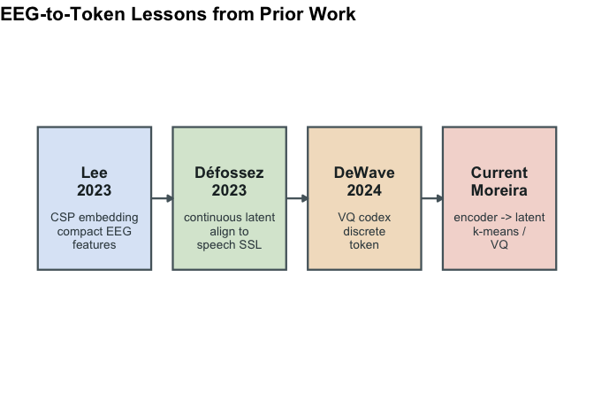

这张图把 `EEG -> token` 相关方法压成 4 个节点。图内英文项如下：

-   `embedding`：压缩后的表示。
-   `latent`：连续隐藏表示。
-   `codex`：离散码本表示。
-   `k-means / VQ`：两种常用离散化方式。

<table>
<caption>
表 14. 从文献里抽出来的 EEG-&gt;token 方法启发
</caption>
<thead>
<tr>
<th style="text-align:left;">
来源
</th>
<th style="text-align:left;">
学到的 EEG-&gt;token 内容
</th>
</tr>
</thead>
<tbody>
<tr>
<td style="text-align:left;">
Lee 2023
</td>
<td style="text-align:left;">
先把 EEG 压缩成结构化 embedding，再去连接下游生成或识别模块。
</td>
</tr>
<tr>
<td style="text-align:left;">
Défossez 2023
</td>
<td style="text-align:left;">
先做连续 latent，再进入 speech latent 对齐。
</td>
</tr>
<tr>
<td style="text-align:left;">
DeWave 2024
</td>
<td style="text-align:left;">
用 VQ / codebook 把 EEG 变成离散 codex，减小跨被试波形差异带来的影响。
</td>
</tr>
<tr>
<td style="text-align:left;">
当前可执行版本
</td>
<td style="text-align:left;">
第一版用 encoder + offline k-means；后续可替换成可训练的 VQ 模块。
</td>
</tr>
</tbody>
</table>

表 14 列说明：

-   `来源`：对应论文或当前实现版本。
-   `学到的 EEG->token 内容`：这篇文献在 token
    化问题上能留下来的方法点。

## 对齐目标与训练组织

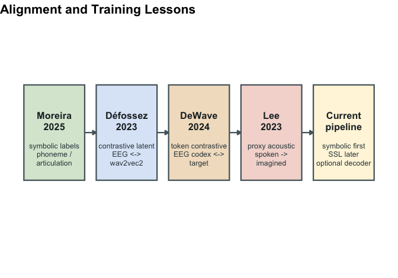

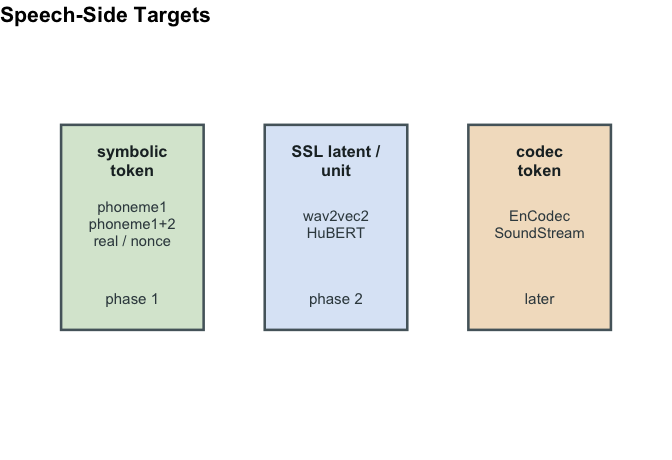

这两张图对应的是对齐目标和训练连接方式。图内英文项如下：

-   `symbolic token`：符号级标签，如音素、真假词。
-   `SSL latent / unit`：自监督语音模型里的连续表示或离散单元。
-   `codec token`：声码器或 codec 层的 token。
-   `phase 1 / phase 2 / later`：第一阶段、第二阶段、后续扩展。

<table>
<caption>
表 15. 从文献里抽出来的对齐与训练启发
</caption>
<thead>
<tr>
<th style="text-align:left;">
来源
</th>
<th style="text-align:left;">
学到的对齐内容
</th>
</tr>
</thead>
<tbody>
<tr>
<td style="text-align:left;">
Moreira 2025
</td>
<td style="text-align:left;">
当前公开标签先落在 symbolic
alignment：phoneme、articulation、real/nonce。
</td>
</tr>
<tr>
<td style="text-align:left;">
Défossez 2023
</td>
<td style="text-align:left;">
直接对齐到预训练 speech model 的连续 latent，核心是 contrastive
objective。
</td>
</tr>
<tr>
<td style="text-align:left;">
DeWave 2024
</td>
<td style="text-align:left;">
对齐对象也可以是离散 token / codex，而不只限于文本或分类标签。
</td>
</tr>
<tr>
<td style="text-align:left;">
Lee 2023
</td>
<td style="text-align:left;">
如果未来要接 voice decoder，需要额外的 acoustic target 或代理监督。
</td>
</tr>
<tr>
<td style="text-align:left;">
当前整合
</td>
<td style="text-align:left;">
训练顺序可写成：symbolic first -&gt; SSL alignment second -&gt; optional
decoder third。
</td>
</tr>
</tbody>
</table>

表 15 列说明：

-   `来源`：对应论文或当前整合版本。
-   `学到的对齐内容`：在对齐和训练组织上能直接使用的部分。

# 当前数据走向 EEG-&gt;Voice 的整合路径

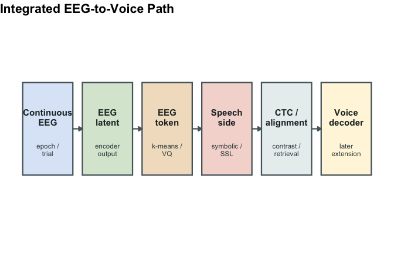

这张图把当前数据下的工作流程拆成几个阶段：

1.  连续 EEG 先切成 stimulus-locked epoch；
2.  epoch 经过 encoder 变成连续 latent；
3.  latent 通过 `k-means / VQ` 变成 EEG token；
4.  EEG token 或 latent 与 speech side 的 `symbolic / SSL` 表征对齐；
5.  在这个基础上训练分类、检索、CTC 或 contrastive 目标；
6.  如果后续引入外部 speech-side target，再接 voice decoder。

图中的英文项：

-   `Continuous EEG`：连续 EEG。
-   `EEG Latent`：编码后的连续表示。
-   `EEG Token`：离散化后的 EEG 单元。
-   `Speech Target`：对齐目标。
-   `Alignment`：对齐和训练阶段。
-   `Voice Decoder`：后续的语音解码器。
