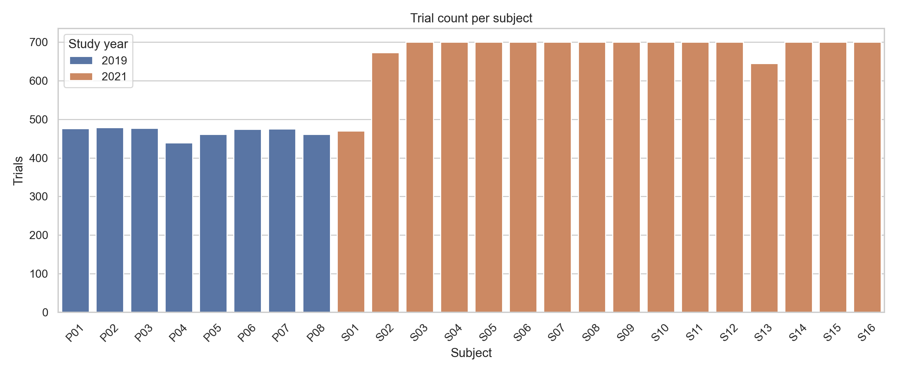
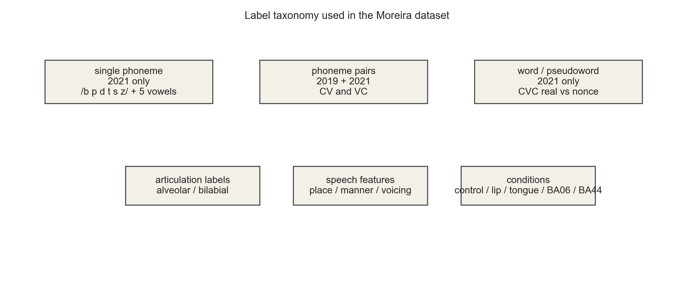
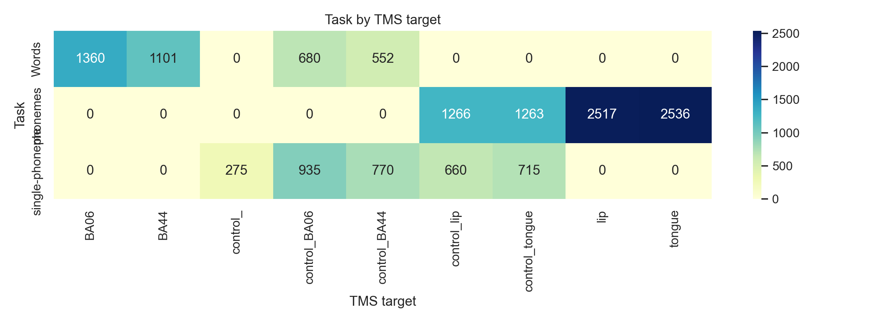
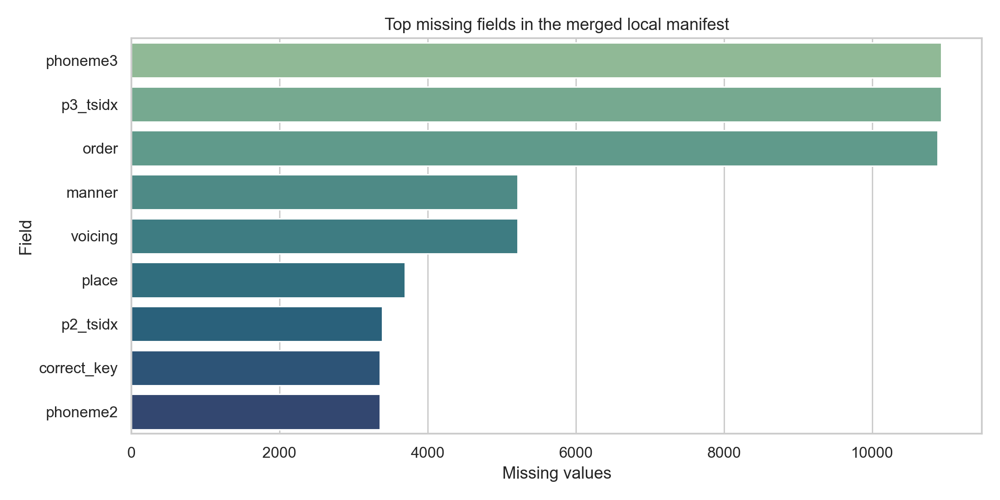
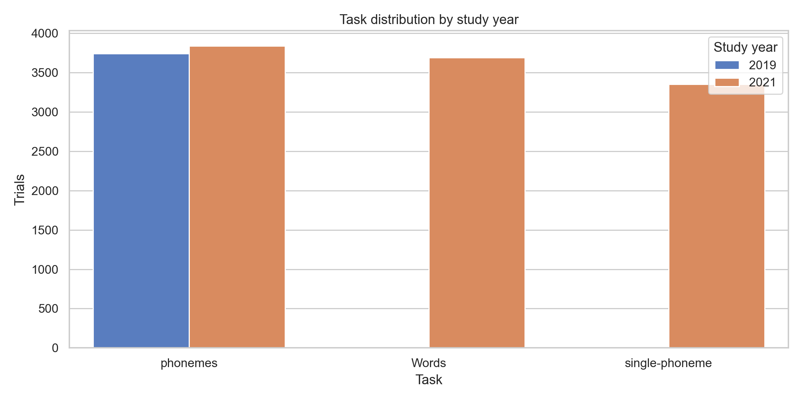
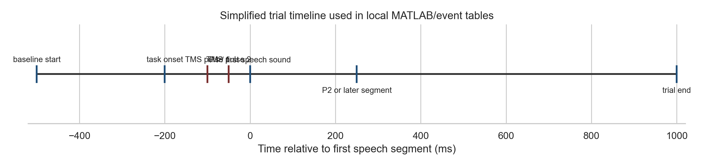
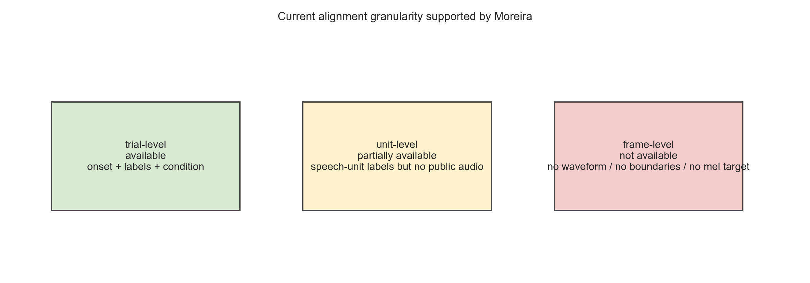
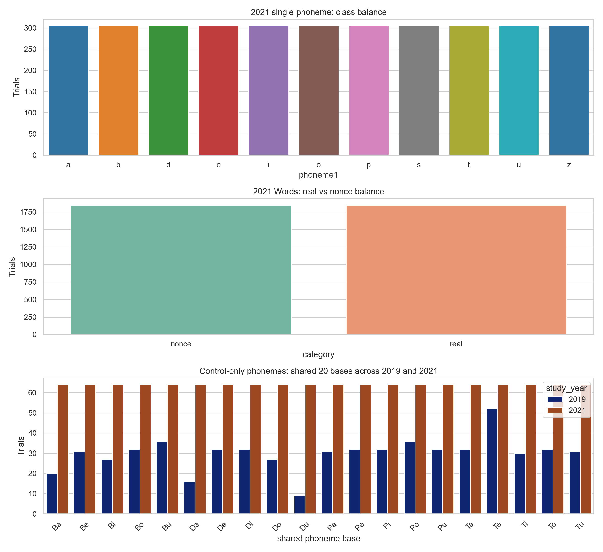
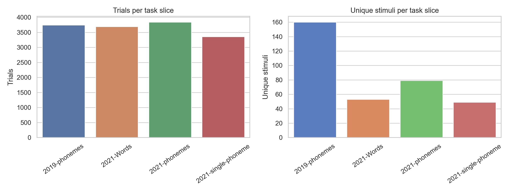
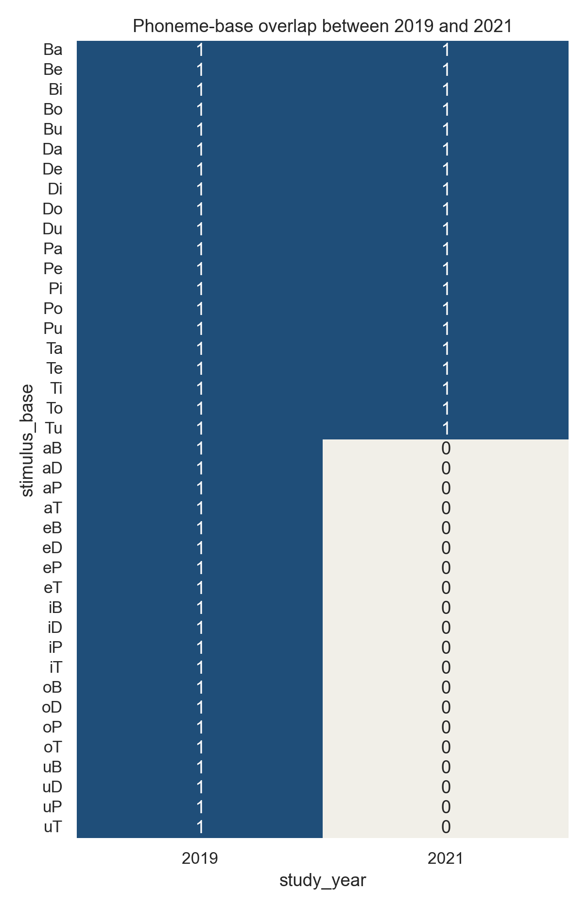

# Moreira 2025 语音解码 EEG 数据集探索报告

## 1. 先给结论

在当前这个更收缩的版本里，这套数据最适合先做三类数据层判断：

1. 判断它最多支持到哪一层 speech alignment：`trial-level / unit-level / frame-level`。
2. 找出哪些子集最适合未来做 `EEG token`，尤其是 `2021 single-phoneme`、`2021 Words` 和 `control-only phonemes`。
3. 判断它离 Lee 2023 那种 `EEG -> voice` 还缺哪些关键监督，而不是直接上训练。

这套数据目前不适合直接当成 `EEG -> voice reconstruction` 主数据集，原因很直接：

1. 实验任务是 `听刺激 + 按键辨别`，不是 imagined speech。
2. 公开结构里最清楚、最完整的是 `EDF + events/channels sidecars + EEGLAB derivatives`，不是现成的“脑电-语音波形配对重建”格式。
3. 数据核心科学问题是 articulation/coarticulation 与 TMS 条件效应，不是语音重建。

所以这轮探索最稳的结论是：`能做，但当前先把数据边界讲清楚，先做 EEG token 数据准备判断，不要现在就上复杂 reconstruction。`

## 2. 数据源关系

这次探索里要把三个来源分清：

1. 本地 GitHub 仓库：主要是论文作者公开的 `MATLAB 技术验证代码 + 事件表 + 电极布局`。它足够让我们看清标签结构，但不是全量原始数据仓库。
2. OpenNeuro `ds006104`：这是当前更规范、可引用的公开主数据版本，采用 `BIDS` 组织，并包含原始 `EDF` 和 `EEGLAB derivatives`。
3. Moreira 2025 论文：负责解释研究设计、任务设置和数据集定位。

这次我实际验证到的 OpenNeuro 元数据如下：

- 数据集 ID：`ds006104`
- 引用版本：`v1.0.1`
- BIDSVersion：`1.6.0`
- DatasetType：`raw`
- 公开镜像里可见 `24` 名受试者目录：`sub-P01` 到 `sub-P08`，`sub-S01` 到 `sub-S16`
- 原始 EEG 文件格式：`EDF`
- 镜像中可见 `56` 个原始 `.edf` 文件，另带大量 `.json/.tsv` sidecars 和 `EEGLAB` 衍生文件

对应输出文件：

- 标准化 manifest：`../exploration_outputs/tables/local_events_manifest.csv`
- 本地汇总：`../exploration_outputs/tables/local_summary.json`
- OpenNeuro 验证：`../exploration_outputs/validation/openneuro_validation.json`
- OpenNeuro 树结构摘录：`../exploration_outputs/validation/openneuro_tree_excerpt.txt`

## 3. 这套数据到底长什么样

### 3.1 受试者与任务

基于本地 `24` 份事件表，我整理出的 merged manifest 一共有 `14630` 行 trial 级记录。

- `2019` 研究：`8` 名受试者，合计 `3742` 行，核心是 `CV / VC phoneme pairs`
- `2021` 研究：`16` 名受试者，合计 `10888` 行，扩展到 `single phoneme + phoneme pairs + word/pseudoword`

任务总量如下：

- `phonemes`: `7582`
- `single-phoneme`: `3355`
- `Words`: `3693`

受试者 trial 数并不完全一致：

- `2019` 最少的是 `P04 = 439`
- `2021` 最少的是 `S01 = 470`、`S13 = 645`
- 大多数 `2021` 受试者是 `700`

图 1 展示了每个受试者的 trial 数：

这张图回答的问题很简单：`样本量是否均匀？`

答案是：不完全均匀，但还在可接受范围内。

### 3.2 任务层级和标签体系

这套数据不是单一任务，而是三层结构：

1. `single phoneme`
2. `phoneme pairs`
3. `word / pseudoword`

同时它还叠加了 articulatory 标签和 TMS 条件标签。

图 2 是我整理的标签体系示意：

如果只从“后续做什么模型最合适”这个角度看，最值得优先利用的标签不是具体词串，而是这些更稳的中层标签：

- `alveolar / bilabial`
- `place / manner / voicing`
- `real / nonce`
- `control / lip / tongue / BA06 / BA44`

这些标签比直接做复杂重建更适合探索期。

### 3.3 TMS 条件和任务耦合关系

本地事件表的 `task x tmstarget` 交叉统计很关键：

- `phonemes` 只和 `control_lip / control_tongue / lip / tongue` 强关联
- `single-phoneme` 主要关联 `control_ / control_BA06 / control_BA44 / control_lip / control_tongue`
- `Words` 主要关联 `BA06 / BA44 / control_BA06 / control_BA44`

也就是说，不同任务并不是共享同一套 TMS 条件。

图 3 直接展示了这个关系：

这张图的重要含义是：

1. 不能把所有任务简单混在一起分析，然后假设标签空间一致。
2. `Words` 任务和 `phonemes` 任务的实验操控不同，分析时应该分开。
3. 如果后面要做 EEG token 数据准备，最好先从 `control-only` 或同一 TMS 子空间内看。

### 3.4 缺失值和字段不一致

这一步是数据工程上最需要先修的地方。

本地事件表里已经观察到两类结构性差异：

1. `2019` 使用 `Correct_Key`，`2021` 使用 `Correct_key`
2. `2019` 有 `order`，但没有 `phoneme3 / p3_tsidx`
3. `2021` 有 `phoneme3 / p3_tsidx`，但大多没有 `order`

字段缺失统计如下：

- `p3_tsidx`: `10937`
- `phoneme3`: `10937`
- `order`: `10889`
- `manner`: `5218`
- `voicing`: `5218`
- `place`: `3693`
- `p2_tsidx`: `3386`
- `correct_key`: `3355`
- `phoneme2`: `3355`

图 4 展示了缺失量最大的字段：

这个图不能简单解读为“数据质量差”，因为很多缺失是任务设计导致的：

- `single-phoneme` 本来就不需要 `phoneme2`
- `2019` 研究本来就没有 `phoneme3 / p3_tsidx`
- `Words` 任务不一定带 `place / manner / voicing`

所以结论不是“数据很脏”，而是：`字段结构跨年份、跨任务不完全统一，必须先标准化后再分析。`

## 4. OpenNeuro 样本验证

这一步我没有直接下载全量 `43 GB`，而是做了低风险验证：

1. 用 OpenNeuro GraphQL 拿到 `ds006104 v1.0.1` 的完整文件树和单文件下载链接。
2. 下载了两个样本的 sidecars：
   - `sub-P01/ses-01/task-phonemes`
   - `sub-S01/ses-02/task-phonemes`
3. 对两个原始 `EDF` 只抓取头部字节并解析 header，确认文件格式和采样信息。

验证结果如下：

- 原始格式：`EDF`
- 两个样本的 `SamplingFrequency` 都是 `2000 Hz`
- `P01 phonemes` 原始 EDF 大小约 `815 MB`
- `S01 phonemes` 原始 EDF 大小约 `835 MB`
- EDF 头部显示 `62` 个 signals
- 对应 `channels.tsv` 中标记为 `EEG` 的通道数是 `61`

这个差异很正常，通常说明 EDF 里还有一个非 EEG 信号或 annotation signal。对于后续分析来说，关键不是这个差异本身，而是：`原始文件、通道表、事件表三者是能对上的。`

样本中还验证到了：

- `channels.tsv` 可正常读取
- `events.tsv` 可正常读取
- 事件字段包含 `onset, duration, trial_type, category, place, manner, voicing, tms_target`

这意味着后面如果用 `MNE` 或其他 EDF 读取工具重建一个 Python 数据观察流程，工程入口是清楚的。

## 5. 现有 MATLAB 流水线在做什么

本仓库的 `matlab_code/analysis.m` 不是通用解码框架，而是一条偏“技术验证”的清洗和 ERP/PSD 流水线。

它的核心步骤是：

1. 导入 `.set`
2. 删除非 EEG 通道
3. 由本地事件表补事件
4. 对 TMS artifact 时间窗插值
5. 重采样和滤波
6. 分 task/condition 切 epoch
7. 人工目检坏 trial
8. 两轮 ICA + 人工删除成分
9. 输出 ERP / PSD / topo 图

这条流水线适合论文里的技术验证，但有三个明显限制：

1. 人工步骤太多，不利于可复现的自动分析。
2. 主要围绕 `ERP / PSD` 做展示，不是为 token 对齐或语音桥接设计的。
3. 代码默认先关注 phoneme pair 和 TMS 条件，不是整个 OpenNeuro 全量任务的统一入口。

所以它的最佳用法不是“直接扩展成主实验系统”，而是：

- 当成原作者信号处理思路的参考
- 用来理解时间窗和事件定义
- 必要时做 ERP/PSD 对照

## 6. 这个数据集和 Lee 2023 的关系

`Lee 2023` 的方向可以当成方法启发，但不能把两者直接等同。

相同点：

1. 都属于 EEG 与 speech decoding 相关问题。
2. 都关心从 EEG 中恢复和区分语音相关表征。

关键不同点：

1. Moreira 数据的核心任务是 `听觉刺激 + 按键辨别 + TMS 条件操控`
2. Lee 2023 更接近 `imagined speech / voice reconstruction`
3. Moreira 当前公开结构里，最直接可用的监督目标是 `phoneme / articulation / word class / condition`，不是“用户想说出的语音波形”

所以 Moreira 更适合做：

- `speech category decoding`
- `articulatory representation analysis`
- `cross-subject generalization`
- `TMS modulation analysis`

而不适合在探索期直接宣称做：

- `imagined speech reconstruction`
- `high-fidelity EEG-to-voice generation`

如果后面一定想往 Lee 2023 那边靠，最稳的说法应该是：

`先用 Moreira 做 speech-related representation learning，再评估能否迁移到更接近 imagined speech 的任务。`

## 7. 图表汇总

图 5 展示了任务分布：

这张图回答的是：`不同任务在两个研究阶段里的比重如何？`

图 6 是简化实验时间轴：

这张图回答的是：`本地 MATLAB 和事件表默认把哪些时间点当成关键分析锚点？`

## 8. 当前版本调整：先只看数据，不做训练

这份报告的当前口径需要再收紧一层。

前面第 1-7 节对数据结构、OpenNeuro 组织方式和现有 MATLAB 流水线的解释仍然成立；但在当前阶段，`分类 baseline / ERP 主线 / 泛化实验` 都不是主任务。现在只回答一个问题：

`Moreira 这套数据，作为你未来 EEG token / speech token 对齐工作的前期数据基础，到底够不够，以及最多能支持到哪一层对齐。`

所以这一版后半段不再讨论训练，而改成：

1. 数据最多能对齐到哪一层
2. 哪些子集最适合未来做 EEG token
3. 哪些监督已经有、哪些关键监督还缺

## 9. 当前数据最多能对齐到哪一层

现在最重要的结论不是“能不能分类”，而是“有没有足够的监督做对齐”。

从公开数据结构看，已经有的监督是：

- `stimulus onset`
- `phoneme1 / phoneme2 / phoneme3`
- `category`
- `place / manner / voicing`
- `tmstarget / tms`

缺失的监督是：

- 公开刺激音频
- 被试自己的 spoken voice
- 逐音素边界和时长
- mel-spectrogram target
- frame-level speech token
- imagined speech EEG

图 7 用最简单的方式总结了这个边界：

对应结论非常明确：

1. `trial-level`：可用。
2. `unit-level`：部分可用，而且已经够做离散 speech-unit 级别的数据准备。
3. `frame-level`：当前不可用。

所以 Moreira 现在最多支持：

`离散 speech-unit 级别的 EEG token 准备`

它现在还不能单独支持：

`Lee 2023 式的 EEG -> mel / voice 重建监督`

这部分的证据表已经单独输出：

- `../exploration_outputs/data_priority/tables/alignment_granularity.csv`
- `../exploration_outputs/data_priority/tables/supervision_signal_matrix.csv`

## 10. 哪些子集最适合未来做 EEG token

这一步完全不涉及模型，只看数据本身干不干净、平不平衡、能不能对齐。

我把最值得关注的子集固定成 3 类：

1. `2021 single-phoneme`
2. `2021 Words`
3. `control-only phonemes`

其中第 3 类还要特别盯住 `2019/2021` 共有的 `20` 个 phoneme base units，因为这是唯一天然带跨年份对齐基础的 slice。

### 10.1 优先级表

我已经把推荐顺序整理成表：

- `../exploration_outputs/data_priority/tables/candidate_subset_priority.csv`

核心结论如下：

1. `2021 single-phoneme` 最适合先看，原因是最干净、最均衡、全部都是 control 条件。
2. `2021 Words` 适合看高层 speech unit，但它更像 coarse lexical token，不是语音波形监督。
3. `control-only phonemes` 值得保留，主要不是因为最平衡，而是因为它是唯一能做 `2019 vs 2021` 对齐观察的 phoneme slice。

### 10.2 最关键的简单结果

`2021 single-phoneme`

- `3355` 条 trial
- `16` 名受试者
- `11` 个 phoneme
- 每类约 `305` 条，几乎完美均衡
- 全部都在 `control*` 条件下

`2021 Words`

- `3693` 条 trial
- `16` 名受试者
- `real/nonce` 基本完全均衡：`1846 vs 1847`
- 同时还包含 `20` 个 lexical bases
- 有 `control_BA06 / control_BA44` 子集，但不是全体 control-only

`control-only phonemes`

- `2529` 条 trial
- `24` 名受试者
- 作为全量 control slice 很有价值
- 真正可跨年份直接比较的 shared base units 只有 `20` 个
- `2019` 有额外 `20` 个 base units，`2021` 没有新增独有 base units

图 8 直接回答“哪部分最平衡、最适合先看”：

图 9 回答“每个任务块到底多大、刺激种类有多少”：

图 10 回答“2019 和 2021 到底共享哪些 phoneme bases”：

如果只从“未来做 EEG token 准备”这个角度看，目前最稳的排序就是：

1. `2021 single-phoneme`
2. `2021 Words`
3. `control-only phonemes`
4. 在第 3 步里再特别聚焦 `20` 个 shared phoneme bases

## 11. 标签和条件结构是否干净

这一版不再把“字段缺失”简单看成脏数据，而是更具体地看：

1. 这些字段是否对未来 token 对齐有用
2. 它们是在所有年份都可用，还是只在部分任务里可用

我补了一张更聚焦的字段表：

- `../exploration_outputs/data_priority/tables/core_field_availability.csv`

它的读法很简单：

- `stimulus / phoneme1 / category / tmstarget / p1_tsidx` 是最稳的基础字段
- `phoneme2 / phoneme3` 只在对应任务中才有意义
- `place / manner / voicing` 更适合 phoneme 任务，不适合 words 任务
- `order` 基本只属于 2019 phoneme pairs

图 11 再把任务和条件结构压缩成一张图：

它回答的是：`标签空间和条件空间是不是干净到可以混着看？`

答案是否定的。

最重要的两个判断是：

1. 不同任务对应的 TMS target 空间不同，所以不能把所有任务看成同一类样本。
2. `Words`、`single-phoneme`、`phonemes` 应该始终分开解释，不能拿一个任务的结论直接外推到另一个任务。

## 12. 未来能做 / 现在不能做

### 12.1 现在就能做的数据层工作

- 把 `single-phoneme` 当成最干净的 EEG speech-unit 数据
- 把 `Words` 当成 coarse lexical token 数据
- 把 `control-only phonemes` 当成跨年份可比 slice
- 明确 trial-level 和 unit-level 的可用监督
- 先把 EEG 侧离散 token 的数据基础讲清楚

### 12.2 现在还不能直接做的事

- 不能把 Moreira 单独当成 `EEG -> voice` 主监督数据集
- 不能直接做 `mel reconstruction`
- 不能直接做 `vocoder` 训练
- 不能直接做 frame-level speech token 对齐
- 不能直接宣称接近 Lee 2023 的 imagined speech setting

### 12.3 如果以后真要往 Lee 2023 靠，还缺什么

- `speech-side token source`
- 公开刺激音频或可复现的合成音频
- 至少是 unit-level 到 speech embedding 的桥接方式
- 更理想的话，还需要 paired spoken/imagine 数据，而不是只有 auditory discrimination

所以当前最稳妥的说法应该是：

`Moreira 适合做监督式 speech-unit EEG token 的数据基础，但不足以单独承担 EEG-to-voice 主监督。`

## 13. 这轮补充产物

这次新增的文件有：

- 补充脚本：`../scripts/generate_moreira_data_priority.py`
- 候选子集优先级表：`../exploration_outputs/data_priority/tables/candidate_subset_priority.csv`
- 字段可用性表：`../exploration_outputs/data_priority/tables/core_field_availability.csv`
- 已有/缺失监督表：`../exploration_outputs/data_priority/tables/supervision_signal_matrix.csv`
- 对齐粒度表：`../exploration_outputs/data_priority/tables/alignment_granularity.csv`
- 图表目录：`../exploration_outputs/data_priority/figures/`

这些东西已经足够支持一次更聚焦的老师讨论，问题可以压缩成三句：

1. `这数据现在能不能用？`
2. `先看哪一块最有价值？`
3. `为什么现在还不能直接做 EEG->voice？`

对应的简短答案就是：

1. 能用，但先用于 `EEG token 数据准备`。
2. 最先看 `2021 single-phoneme`，其次 `2021 Words`，再看 `control-only phonemes`。
3. 因为公开数据缺少音频、边界和 frame-level speech supervision。

## 14. 参考链接

- Moreira 2025 论文：https://www.nature.com/articles/s41597-025-05187-2
- OpenNeuro 数据集：https://openneuro.org/datasets/ds006104
- 数据 DOI：https://doi.org/10.18112/openneuro.ds006104.v1.0.1
- OpenNeuro CLI 文档：https://docs.openneuro.org/packages/openneuro-cli.html
- OpenNeuro API 文档：https://docs.openneuro.org/api.html
- OpenNeuro Git 说明：https://docs.openneuro.org/git.html
- OpenNeuro 镜像仓库：https://github.com/OpenNeuroDatasets/ds006104
- Lee 2023 代码仓库：https://github.com/youngeun1209/NeuroTalk
